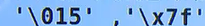
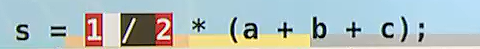
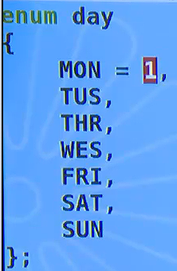
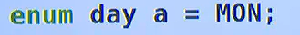
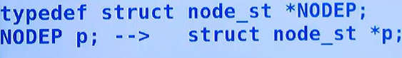
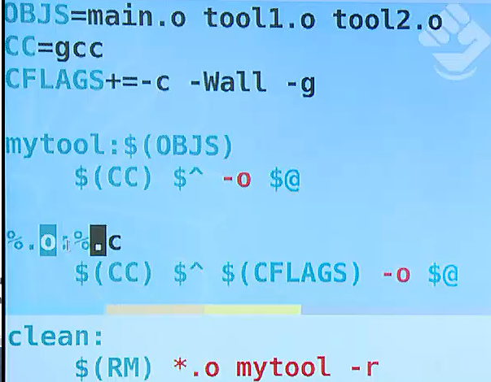

`printf`是有返回值的。返回所打印的字符串的字符数。

`return 0` 是给其父进程看的（比如说shell）


条件编译实现多行注释


float ：32 = 1（符号位）+8（指数）+23（精度部分）


ASCII码表的第一个：`'\0'`，表示NULL

防止野指针而将指针置为NULL；字符串结尾的NULL；


如何对float类型的数进行比较：注意float 的数是不精确的 不能用`==`直接判断它和某个数`0`相等，要使用绝对值


char型是否是有符号数是不确定的

`0	'0'	"0"	'\0'`分别代表什么意思？


变量的定义


常量：

整型常量：1 2

实型常量：3.14

字符常量：`'a','\n','\t'`(八进制、十六进制)

字符串常量（双引号包围的若干字符）：空字符串为`""`只包含**\0**

标识常量

#define 只负责将宏名替换为宏体

 #define PI	3.14


进行预处理

```shell
gcc -E hello.c > hello.i
```


#define 只是负责做替换，不进行任何的求值。因此要特别注意宏体被替换到代码中的结果。最好将宏体最外层加上（）


带参数的宏：

```c
#define	MAX(a,b)	(a > b ? a : b)
```


当传入参数为带有++时。这个宏不会按照我们预期的结果运行。因为i++会执行两次

解决方案其实是模拟函数将参数压入栈顶后再使用的操作：先声明两个变量去接收传入的参数，再去比较这两个变量本身


还可以进一步做修改：


typeof(a)返回a的类型，


auto（默认） 位于栈空间中

register（建议性）寄存器类型。不一定被放到寄存器中。会由GCC判定。

只能定义局部变量不能定义全局变量+大小限制，32位+没有地址，寄存器类型的变量无法被打印出地址查看或使用。

( inline也是建议性的 )

static 静态变量。这种变量会被自动**初始化**为`0 `或者空值`\0` ， 并且这种变量的值有继承性。常用于修饰变量或者函数。

extern（说明型） 说明定义不在当前文件中。不能改变被说明的变量的值或类型


变量的生命周期和作用范围

auto 声明的变量是不会自动初始化的。

static 声明的变量只会在内存中存在一份，当第二次遇到同一变量名的静态声明时，不会报错，

由static修饰的变量，其存储类型为全局静态区，变量在程序的整个运行过程中不会被销毁，并且只会被初始化1次。（主要是局部变量生命周期延长）


`__FUNCTION__`会被替换成其所在的最内层函数的名字


`fopen()`


如果打开失败则会返回空值NULL，并且设置`errno`，它以前是一个全局变量。现在已经做过一定的私有化处理


多个.c组成一个小工程


 

全局变量的问题

当存在多个.c文件时，每个文件中都有相同名字的全局变量时，会产生冲突。应在这几个全局变量前加上static修饰。


在某个.c文件中用static修饰某个函数会使得该函数仅在当前文件中是可见的，

防止该函数对外扩展。可以通过定义一个普通函数（公开接口）来包装此静态函数实现在其它文件中间接调用静态函数。

（static 起到了隐藏函数或变量的作用，使其可见范围被限制于所在的原文件）


对extern的解释：

extern 只是表明某个在当前文件中出现的某个全局变量是在其它文件中声明的。

即起到了扩展变量可见范围（扩展到其它文件中）的作用（普通的全局变量的可见范围是其声明所在的源文件）


运算符和表达式


运算符：
操作数个数

当前运算符的结合性

位运算


 

sizeof 是运算符，返回类型或变量所占字节数 


强制类型转换


将第N位置为1	 按位或 |   1 << N

将第N位变成0	按位与 &  1111101111 = ~0000010000（1左移N位取反）


`printf("%m.nf")`左补空格，右控位数


 

m.n中的m是有正负的，默认的+m表示右对齐，-m表示左对齐


使用%o 或%x 以八进制或十六进制打印数字时，应加上#号，使得输出结果前加上前缀标识进制


long 12L

long long 12LL 

  


两个用于调试的宏，`__FUNCTION__`用表示当前语句所在函数。`__LINE__`表示当前语句所在行号


\n 会使得printf的缓冲区强制刷写到终端设备


因此，该程序不会打印出任何东西。因为没有\n 缓冲区也没满，程序也没有结束（程序退出前最后的工作是刷写IO流）

这三个条件一个都没有满足，printf的缓冲区当然不会刷写


`sqrt `的两个使用注意：

1、包含头文件` <math.h>`

2、链接时加上` -lm `选项	`gcc test.c -lm`

或者使用makefile，再make test

```bash
vim makefile

## 添加：
CFLAGS+=-lm
```


下面这个程序没有考虑隐式类型转换。

1/2 会按照int 之间的运算的得到0 ,因此 s 永远是0 




应改为


`fprintf(stderr,"XXXX")`可以起到抛出异常信息的作用。`stderr`表示标准错误流。

从控制台获取输入。以空格进行分割。分别表示给 a，b，c 赋值。


## 指针


### 变量与地址

变量是存储区的别名。变量名（标识符）是地址值的别名。

指针就是地址。指针变量就是存放指针（地址）的那块存储空间


`*&x = x`

不论是什么类型的指针，其所占存储空间均为`4字节`（32位）/ `8字节`（64位）


指针一旦被声明出来，就一定要给它一个明确的指向。

一般不会将一个显式的地址值赋给指针。

我们采用二级指针的方式，用一个指针变量存放地址，


空指针

 NULL是一个定义好的宏。一般表示起始地址为0。当访问这个地址时，会产生段错误的提示。0号地址不分配给任何进程。包含NULL指针的进程没有权限去访问起始地址的那块内存，发生段错误。

将指针置为NULL是为了防止野指针的产生。野指针是指向不明的指针


通用的指针类型`void *`


&作为一元运算符的结果是指针类型的值，而不仅仅是地址，可以粗略理解为地址+类型。

这就是为什么形参类型为int * p的函数，可以将形如&m的值传入此函数中。

因为`类型* 标识符`代表的是指向某类型的指针类型的变量，它当然可以接受&的运算结果：指针类型的值


指针运算：

& * 关系运算（指向一连续区域） ++ --


指针和数组

指针相当于带类型的地址


```c
a[i] == *(a+i)
```


（p是被初始化为a 的`int* `指针）


`p`和`a`的差别在于，`p`是变量，`a`是常量。故`p++` 是可以的，而`a++`不行


`char*`和字符数组：


`puts()`的作用是从当前入参的位置开始输出，直到遇到尾零`\0`


下面第一行的写法显然是错误的，因为str是一个指针常量（str为字符数组），试图改变常量的值


注意：可以将一个字符串字面量赋值给一个char指针！ 


这里体现了char数组和指向char的指针的区别。

"hello"对于char* 和char数组是不同的。

char数组是会分配一块连续的内存（其内容可变动）用来存放hello

而char指针，则是先有一个存储空间分配给**常量**(其存放内容不可改变)来存放hello


因此给数组“重新赋值”不能用str= 这种改变指向的方式（str是指针常量），而是用strcpy改变原地址中存放的内容

但给char* 重新赋值则相反，strcpy显然不能去覆写一块对应着常量的内存空间；然而因为它只是一个普通的char指针，因此可以改变其指向，让它指向另外一个常量world


const和指针

const表示一个变量除了初始化之外不能被写入。就是只读的。

好处是这种常量可能会被**缓存**（减少寻址所花时间），并且显式指明某个变量是常量


但是这种只读性只会约束在标识符（变量名）上，毕竟那块内存并不是真的不可写入。因此可以通过指针指向地址，随后用*运算符重新赋值即可（编译通过，但会报警）


`const TYPE *p` 不能通过`*p =`进行赋值

`TYPE  *const p` 指针的指向不能由` p =` 进行修改


`const TYPE *p`形式的入参：表示不能在此函数中通过此指针修改所指向的变量的值


指针数组：元素为某类型的指针 `TYPE*  p[N]`

数组指针：指向某类型的数组（存放TYPE类型的容量为N的数组）

`TYPE（*p）[N]`表示`*p`指向的是数组`TYPE  [N]`

函数指针、


puts()的入参是指针类型的值


## 数组


数组的下标必须是常量表达式。

一块连续的内存空间，元素顺序紧挨着存放

未进行初始化的数组元素的值是不确定的，可能是0，也可能不是。

默认声明方式中，相当于省略了存储类型auto，该关键字不会做任何初始化操作。


static声明的变量被分配到静态区中，会有自动初始化为0的行为发生。

scanf

手动输入的方式为每个数组中的元素指定值。


```c
scanf( "%d分隔符%d分隔符%d分隔符" , &a , &b , &c )
```

输入时每输入一个值后，输入对应的分割符，再输入下一个元素


数组名表示一个指针类型的值，它指向数组中的` 0 `号元素

`%p` 是指针类型的值的格式化字符串


不能用这种方式给数组重新赋值：因为数组名是常量指针，不能修改


数组是可以越界的，就是可以给超过范围a[k] 赋值。


表示数组长度：


冒泡排序数组


选择排序

从第i个元素开始，选出最小元素的下标，只要下标不是i，就交换第i个元素和最小元素。


十进制转二进制

/2 = 商	-----	余数0、1

一直除以2到：商为0


求1000内的所有素数：


### 二维数组


全部初始化：


部分初始化：（剩余元素置为0）


行号可以省略，但列号一定不能省


矩阵转置（行列交换）


数组名是常量指针，无法作为左值使用


 


二维数组的指针运算：

a+k表示二维数组中的k行，换句话说二维数组中的每个元素是一个个一维数组，这样的每个一维数组构成每一行。a+k运算会跳转到下个一维数组的0号元素上


### 字符数组


#### 初始化


单个字符初始化：


使用一个字符串初始化字符数组，注意，串的末尾有一个尾零\0

它会占用一个数组元素。 


puts(指针类型的值)

gets(地址)


在scanf("%s",str) 中，以空白字符作为分割符


strlen返回字符串的字面长度（不包含尾零`\0`），计数 直到遇到第一个尾零。

sizeof作用在字符串上会返回其实际所占字符数（包含尾零'\0'）


`strcpy`+`strncpy`

`strcpy`将src指针所指向的字符串（包括其尾零\0）拷贝到dest指针所指的地方。目标指针处必须有足够的合法空间容纳原指针指向的字符串


`strncpy`增加了一个参数，表示从源字符串**最多**拷贝多少个字符串到目标指针处。一般来说这个大小设置成和*dest一样大


连接字符串`strcat`


将src所指向的字符串追加到dest所指向的字符串的尾零处（即替换掉尾零那位）


比较两个字符串`strcmp`


通过返回值的正负来判断二者的字典序大小关系。其实际上比较的是ACII码


`strncmp`中的参数n表示**最多**只比较这两个字符串的前N位。


计算输入的整个串中有多少个以空格为分隔符的子串？


问题的关键是要跳过多个空格直到遇到下个字符串。

flag= 0 表示当前下标不在一个字符串；flag表示当前索引对应于某个字符串内部。


## 函数的传参：

### 值传递

形参列表可看作是在函数调用时对形参的初始化。

形参是在该函数中被初始化的变量。

对形参的任何修改都不会ying'x


### 地址传递


一个进程的退出状态是给其父进程看的。


main 函数的几种参数列表：

`int main(void)`


argc用来表示传入参数的个数，argv用来表示参数列表

`int main( int argc , char* argv[] )`


`int main(int argc , char** argv )`


参数包括运行main本身的命令，因此argc=4


通配符*会被解析成具体参数，因此这里的argc并不是2，而是计算实际传入的参数个数，为 4


在形参位置的int array[] 和int *p 是等价的，也就是说 sizeof 形参中的数组时，不会得到数组中的元素所占字节总数。

因为在正常的数组初始化中，会显式或隐式地指出数组容量。而作为形参的数组类型在函数调用时被实际传入的是数组起始地址（准确来说是表示起始地址的指针值），这里没有隐式、显式指明数组的容量，当然会被当做一个指针对待，因此sizeof  = 8

一级指针的标识符和数组名的唯一差 c别是数组名是常量

作为形参时，int arr[] 完全等价于 int * const pt


传入二维数组：

1、当成一个一维数组使用


2、指向一维数组的指针

`int (*p) [二维数组的列数] , 行数 , 列数`

这种指针的sizeof结果仍然是 8


3、`int arr[][列数],行数，列数`


【指针变量有类型，指针变量用来存放地址值】


`arr[X]`不能理解为该数组的`X`号位置存放的值，二维数组就是最好的反例。二维数组的每个存储单元存放的都是具体的元素，并没有存放地址。`arr[X] = X[arr] = *(arr+X)` 要理解成**指针运算的简写**形式。

这样就可以理解下表中实参和形参的对应关系了（第一行箭头为实参；第二行箭头为形参类型）


这种指向一维数组的指针可以拿到其数组容量：


实现字符串拷贝函数 


函数指针

TYPE (* 指针名)  （形参）


函数指针的数组：

函数返回类型 （ *arr[N] ）( 函数形参 )


调用：


### 预处理指令

`#include <XXX>/"XX"`源文件包含指令（通常用于包含头文件，但不限于头文件）；预处理阶段会将此指令替换为源文件内容


`#define` 宏定义

分为变量式宏定义+函数宏定义


函数式宏定义

记号串化：

替换列表中有#，且紧挨着形参，那么它将会在预处理期间被转化为一个字符串。


记号黏连：

替换列表中含有## 且位于两个记号之间，则会被合并成一个记号


## 结构体


嵌套定义


结构体的初始化


引用结构体成员

`结构体名.成员名`


(嵌套定义的初始化和引用)


对结构体的**部分成员**进行初始化：用`.成员名=` 相当于this.成员


用指针访问结构体


结构体数组


### 结构体在内存中的存储

为何具有相同成员的结构体所占用的字节数是不同的？

地址对齐！


加上这样的宏来声明结构体可以不然其进行对齐存储


`4+1+4 = 9 字节`


### 作为形参的结构体

传参方式为**值传递**，将成员的值一个个压入栈中。传参开销很大。

`sizeof` 的结果为该结构体实际占用字节数（12字节）：


一般使用**结构体指针**作为形参：


调用：


此时`sizeof`的结果当然是8个字节


结构体的简单使用：


可以定义**无名结构体**，但是必须在声明此结构体类型是完成所需全部变量的初始化。


同一类型的**结构体变量之间可以用 =** 直接完成所有成员的赋值


## 共用体


共用体中的成员同一时间内只能有一个成员存在。所占字节数是最大的成员字节数


嵌套定义：


位域


枚举类型


定义枚举类型


每个成员都代表一个整数，默认从`0`开始计数。

也可以手动指定值，`MON`之后的成员的值从`1`开始顺次增加




手动指定枚举成员的值的规则是，从显式被指定了值的成员开始顺次增加1，直到遇到下一个被显式赋值的成员，开始为其后的成员继续顺次增加


> **MON = 1** TUS =2  THR = 3  WES=4;
>
> **FRI = 1**  SAT =2  SUN=3


初始化枚举类型




使用方法：把枚举成员当成**类似宏定义**来替代整数编码。好处是不会被预处理替换掉


## 动态内存管理


auto 栈

static 静态区

 动态内存分配使用的是**堆**空间

 


`size_t` 一般就是由`typedef`定义出的整型`int`


**指针 = 类型 + 起始地址**

`void*` 就可以看成单纯的**地址**（因为`void`不是一个包含长度信息的类型）

`void*`类型的值可以<u>赋值</u>给**任意类型的指针**，也可以<u>接收</u>**任何类型指针**的值


### 1、malloc

`malloc`会在堆上分配出连续的size字节，返回其起始地址`void*`。


### 2、calloc

`calloc`申请一块用于**连续存放N个成员**的内存空间`nmemb ✖ size`

`size_t	nmemb`：成员个数

`size_t	size`：每个成员所占字节数


### 3、realloc

`realloc`**重新分配**使用` calloc/malloc `所返回的指针所指向的内存


`viod* ptr` ：由calloc/malloc 返回的指针

`size_t size `：新的大小（字节数，可比之前占用的空间大）


当需要使用`recalloc`扩充原来的内存大小时，假若原始指针所指向地址没有足够大的连续空间，那么会另寻一块**新的足够大的连续空间**，返回新空间的起始地址，并释放原来的空间


使用方式：需要用`if`判空来确定是否成功分配了空间。最后要加上`free`来释放指针所指向的那块空间


下面这种写法是完全没有必要的，不需要强制类型转换，`void*`本来就能赋值给**任意**类型的指针变量。

除非没有正确包含头文件，这会使得函数没有声明，使得将无声明函数的返回值类型默认当作是`int`


动态数组的实现


内存泄漏一例：func函数的形参类型是败笔。传递的是指针变量保存的地址本身


free一个空指针是没有任何问题的。因此该程序的内存泄露不是直接能看出来的。


破解1：修改传参类型，将原来的指针值传递，改成传递此指针本身的地址 


破解2：修改返回值类型，并用原来的指针接收函数返回值


free(p)之后的p是个野指针。因此free后一定要让指针置空，让程序有报出段错误的能力


### typedef

给类型重命名的目的是为了解耦，以便于以后需要修改此类型，只需修改对应的`typedef`声明


与`#define`相比的好处：用一条语句声明多个指针时，typedef可以保证语义不发生扭曲


给数组类型改名：


给结构体改名：


给结构体指针改名：




**更简练**的重命名某结构体及结构体指针：


给某类型的**函数**起别名


## makefile 


依赖关系分析：


原始的makefile形式


浓缩版makefile形式




---


